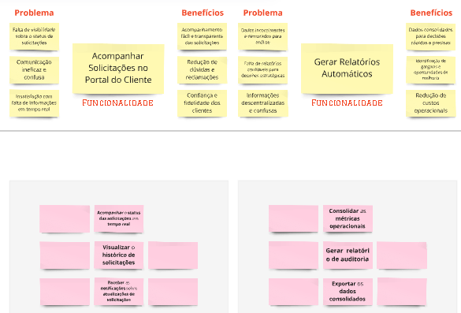

# PBB - Product Backlog Building

## Contexto

A TechFix é uma empresa especializada em suporte técnico e manutenção de equipamentos, atendendo tanto clientes corporativos quanto residenciais. Apesar de consolidada no mercado, a empresa enfrenta desafios operacionais significativos, como atrasos no atendimento, falhas de comunicação, retrabalho e baixa satisfação dos clientes. Esses problemas têm impacto direto na eficiência da equipe, na experiência do cliente e na reputação da empresa.

Com o objetivo de superar essas dificuldades, a TechFix busca soluções tecnológicas para otimizar seus processos, como agendamentos mais eficientes, registro padronizado de serviços, coleta automatizada de feedback e geração de relatórios detalhados para os gestores. A proposta é implementar um sistema integrado que atenda às necessidades das personas-chave: técnicos de campo, atendentes, clientes corporativos e a diretoria de operações.

## Personas

### Carlos – O Técnico de Campo
Carlos é responsável por realizar manutenções e reparos em uma variedade de equipamentos, desde servidores corporativos até sistemas de automação residencial. Ele enfrenta desafios como a falta de acesso ao histórico dos equipamentos, comunicação ineficiente com a central e a necessidade de registrar informações manualmente, o que gera atrasos e retrabalho. Para desempenhar melhor seu trabalho, Carlos precisa de ferramentas móveis e integradas que permitam diagnósticos rápidos e registro de serviços em tempo real, além de acesso a guias técnicas e históricos detalhados.

### Mariana – A Atendente
Mariana é a responsável por atender os clientes e organizar os agendamentos. Seu trabalho é dificultado pela falta de informações centralizadas, o que resulta em erros de agendamento, retrabalho e insatisfação dos clientes. Mariana precisa de um sistema automatizado para gerenciar agendamentos, enviar notificações e integrar as informações dos clientes, proporcionando maior eficiência e reduzindo conflitos operacionais.

### Rafael – O Cliente Corporativo
Rafael é gerente de TI em uma empresa que depende dos serviços da TechFix para garantir a continuidade operacional. Ele enfrenta atrasos na resolução de problemas críticos, falta de transparência no acompanhamento de solicitações e dificuldade para obter informações confiáveis. Rafael precisa de um portal que permita acompanhar as solicitações em tempo real, receber notificações automáticas e acessar relatórios detalhados sobre os serviços realizados, atendendo às exigências do SLA e garantindo maior confiabilidade.

### Ana – A Diretora de Operações
Ana supervisiona as operações da TechFix e busca constantemente melhorar a produtividade, a eficiência e a experiência do cliente. No entanto, ela enfrenta desafios como sistemas desatualizados, relatórios inconsistentes e falta de visibilidade sobre o desempenho da equipe e dos processos. Ana precisa de dashboards centralizados, relatórios automáticos e ferramentas de monitoramento em tempo real, que permitam análises estratégicas para identificar gargalos e implementar melhorias de forma proativa.

## MIRO

## Quadro do Miro

<iframe src="https://miro.com/app/board/uXjVL7x-bvg=/" width="100%" height="600" frameborder="0"></iframe>

*Link do Miro:* [MIRO](URL "https://miro.com/app/board/uXjVL7x-bvg=/")

## Problemas e Expectativas

## Personas

## Funcionalidades e PBIs

---
### (continuação)

### (continuação)

## Historias de Usuário e BDD (Behavior-Driven Development)

### US01
*US01: Eu, como técnico de campo, quero registrar informações do serviço técnico no sistema móvel para registros em tempo real e redução de erros.*

- 1) O técnico deverá conseguir realizar login no sistema móvel utilizando credenciais exclusivas previamente cadastradas e após isso exibir a mensagem “Login realizado com sucesso”.

- 2) O sistema deverá exibir todos os campos obrigatórios para o registro do serviço e impedir a submissão do formulário se algum desses campos não estiver preenchido, exibindo mensagem de erro.

- 3) Após a submissão do registro, o sistema deverá sincronizar automaticamente os dados com o sistema central em, no máximo, 5 minutos.

### US02
*US2: Eu, como técnico de campo, quero que os registros de atendimento realizados no modo offline sejam automaticamente sincronizados com o sistema central assim que a conectividade for restabelecida para que guias técnicos e históricos estejam sempre atualizados.*

| **Cenário** | Sincronização de dados coletados com o sistema central |
|-------------|--------------------------------------------------------|
| **Dado**    | que o técnico de campo tenha registrado informações obrigatórias (por exemplo, ID do cliente, descrição do serviço, data/hora) no sistema móvel durante um atendimento |
| **E**       | que o dispositivo esteja conectado à rede (com latência de até 50 ms, medida por um teste de conectividade) |
| **Quando**  | o técnico acionar o botão “Sincronizar” na interface de registro |
| **Então**   | o sistema deverá transferir todos os registros pendentes para o sistema central, verificando a integridade dos dados  |
| **E**       | a sincronização deverá ser concluída em até 2 minutos, com mensagem de “Sincronização realizada com sucesso” exibida na interface. |

### US03

*US3: Eu, como técnico de campo, quero consultar os históricos técnicos no local do cliente para melhor produtividade e diagnósticos mais rápidos.*

- 1) O sistema deverá disponibilizar uma interface de pesquisa que permita buscar históricos por cliente ou número de solicitação com resultados exibidos em menos de 3 segundos.

- 2) Os históricos devem incluir informações como serviços realizados, peças trocadas e notas técnicas.

- 3) O acesso deve ser possível mesmo em locais com conexão limitada, utilizando sincronização offline.

### US04
*US4: Eu, como atendente, quero organizar os agendamentos com base na disponibilidade e localização dos técnicos para processos mais organizados e eficientes.*

- 1) O sistema deverá exibir um calendário integrado contendo a agenda de todos os técnicos cadastrados, permitindo a visualização clara dos horários agendados.

- 2) Os horários disponíveis devem ser atualizados em tempo real.

- 3) Conflitos de agendamento devem ser sinalizados automaticamente com sugestões de horários alternativos.

### US05
*US5: Eu, como atendente, quero enviar notificações automáticas aos técnicos e clientes para redução de atrasos e retrabalho.*

| **Cenário** | Enviar notificações automáticas sobre agendamentos |
|-------------|------------------------------------------------------|
| **Dado**    | que a atendente atualize um agendamento (por exemplo, alteração do horário) utilizando a interface de gerenciamento de agendamentos |
| **E**       | que os dados de contato (e-mail) do técnico e do cliente estejam cadastrados e válidos |
| **Quando**  | a atualização for confirmada (clicando em “Salvar Alteração”) |
| **Então**   | o sistema deverá enviar automaticamente uma notificação para o técnico e para o cliente, contendo a nova data e horário |
| **E**       | essa notificação deverá ser enviada em até 10 segundos após a confirmação, podendo ser verificada via logs de envio. |

### US06
*US6: Eu, como atendente, quero atualizar os agendamentos em caso de imprevistos para melhora da experiência do cliente.*

| **Cenário** | Atualizar agendamentos em caso de imprevistos |
|-------------|-----------------------------------------------|
| **Dado**    | que um imprevisto ocorra (por exemplo, um técnico fique indisponível) |
| **E**       | a atendente acesse a agenda pelo módulo “Gerenciar Agendamentos” (acessível via menu “Agendamentos”) |
| **Quando**  | ela alterar o horário do agendamento e confirmar a alteração |
| **Então**   | o sistema deverá atualizar imediatamente o novo horário (dentro de 5 segundos) |
| **E**       | enviar notificações automáticas para o técnico e para o cliente com o novo horário, utilizando canais previamente configurados |
| **E**       | caso o novo horário gere conflito, o sistema deverá sugerir pelo menos duas alternativas de horários disponíveis na mesma tela. |

### US07
*US7: Eu, como cliente corporativo, quero acompanhar o status das solicitações em tempo real para acompanhamento fácil e transparente das solicitações.*

- 1) O cliente deve poder acessar um portal seguro com login e senha.

- 2) O status deve ser atualizado automaticamente após cada etapa do processo ("Em análise", "Em andamento", "Finalizado").

- 3) O portal deve exibir notificações em tempo real sobre alterações no status.

### US08
*US8: Eu, como cliente corporativo, quero visualizar o histórico de solicitações no portal para redução de dúvidas e reclamações.*

- 1) O histórico deve incluir todas as solicitações realizadas nos últimos 12 meses.

- 2) Cada entrada deve conter informações como data, descrição do serviço e técnico responsável.

- 3) O sistema deverá permitir a busca e filtragem do histórico por tipo de serviço e intervalo de datas com os resultados sendo exibidos em menos de 3 segundos.

### US09
*US9: Eu, como cliente corporativo, quero receber notificações sobre atualizações de solicitações para ter mais confiança e fidelidade*

### US10
*US10: Eu, como diretora de operações, quero visualizar um dashboard que consolide métricas-chave  para tomar decisões rápidas e precisas sobre a eficiência operacional..*

- 1) O dashboard deverá apresentar, de forma clara, as métricas operacionais, incluindo o número total de serviços concluídos, tempo médio de atendimento e índice de feedback do cliente.

- 2) Os dados devem ser atualizados automaticamente a cada 24 horas.

- 3) O sistema deverá permitir a personalização de filtros no dashboard por período, região e tipo de serviço com as alterações refletidas imediatamente na visualização.

### US11
*US11: Eu, como diretora de operações, quero gerar automaticamente um relatório de auditoria para identificação de gargalos e oportunidades de melhoria.*

| **Cenário** | Gerar relatórios de auditoria de forma automática |
|-------------|-----------------------------------------------------|
| **Dado**    | que o sistema esteja registrando os dados de operações (por exemplo, registros de atendimentos, tempo médio de atendimento) |
| **E**       | a diretora de operações acesse o painel “Relatórios de Auditoria” clicando no ícone “Auditoria” no menu principal |
| **Quando**  | ela selecionar a opção “Gerar Relatório PDF” e confirmar a ação |
| **Então**   | o sistema deverá gerar automaticamente um relatório em PDF contendo:
Total de serviços realizados nos últimos 30 dias
Tempo médio de atendimento
Quantidade de reatendimentos |
| **E**       | o relatório deverá estar disponível para download em até 1 minuto. |

### US12
*US12: Eu, como diretora de operações, quero exportar um relatório consolidado para redução de custos operacionais.*

| **Cenário** | Exportação de dados consolidados para planejamento estratégico |
|-------------|----------------------------------------------------------------|
| **Dado**    | que a diretora de operações acesse o painel “Relatórios Consolidados” por meio do menu “Planejamento Estratégico” |
| **E**       | que os dados exibidos estejam atualizados (com um timestamp de “Última Atualização” não superior a 5 minutos) |
| **Quando**  | ela clicar no botão “Exportar para Excel” e confirmar a ação |
| **Então**   | o sistema deverá gerar um arquivo Excel (.xlsx) contendo os dados consolidados (por exemplo, número de serviços realizados, tempo médio de atendimento, custo operacional estimado) |
| **E**       | E o arquivo deverá estar pronto para download em até 1 minuto. |

### US13
*US13: Eu, como cliente corporativo, quero receber pesquisas de satisfação após o atendimento para feedback em tempo real e de fácil acesso.*

- 1) O sistema deverá enviar automaticamente uma pesquisa de satisfação por e-mail no prazo máximo de 5 minutos após a conclusão do serviço.

- 2) O questionário deve incluir, no mínimo, 5 perguntas objetivas e um campo para comentários abertos.

- 3) As respostas devem ser registradas no sistema central e associadas ao cliente.

### US14
*US14: Eu, como diretora de operações, quero analisar os resultados do feedback para melhor compreensão da experiência do cliente.*

### US15
*US15: Eu, como diretora de operações, quero quero gerar um relatório consolidado dos feedbacks dos clientes para implementação mais rápida de melhorias.*

| **Cenário** | Gerar relatórios consolidados de feedback |
|-------------|-------------------------------------------|
| **Dado**    | que a diretora de operações acesse a seção “Feedback Consolidado” pelo menu “Relatório Consolidado” |
| **E**       | que existam, no sistema, pelo menos 30 registros de feedback dos últimos 12 meses |
| **Quando**  | ela clicar no botão “Gerar Relatório Consolidado em PDF” e selecionar o período desejado (Exemplo: últimos 6 meses) |
| **Então**   | o sistema deverá gerar um relatório em PDF contendo:
Média de satisfação por técnico
Número de respostas por tipo de serviço
Principais reclamações extraídas dos comentários
E o relatório deverá ser disponibilizado para download em até 2 minutos. |

### US16
*US16: Eu, como técnico de campo, quero enviar mensagens instantâneas para a central para comunicação rápida e centralizada.*

- 1) O sistema deverá permitir o envio de mensagens instantâneas entre usuários cadastrados e exibir um indicador de confirmação de entrega para cada mensagem enviada.

- 2) As mensagens devem ser organizadas por categoria, como "Atualização de serviço" ou "Solicitação de suporte".

- 3) As conversas devem ser armazenadas para consulta posterior por até 6 meses com funcionalidade de busca por data e categoria

### US17
*US17: Eu, como atendente, quero compartilhar as atualizações de serviços em tempo real com as equipes para redução de erros operacionais.*

### US18
*US18: Eu, como diretora de operações, quero registrar as conversas internas para maior alinhamento entre as equipes.*

