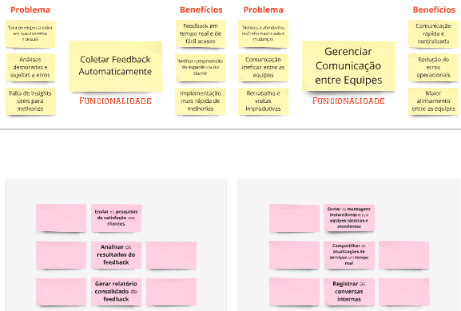

# PBB - Product Backlog Building

## MIRO

## Quadro do Miro

<iframe src="https://miro.com/app/board/uXjVL7x-bvg=/" width="100%" height="600" frameborder="0"></iframe>

*Link do Miro:* [MIRO](URL "https://miro.com/app/board/uXjVL7x-bvg=/")

## Problemas e Expectativas

## Personas

## Funcionalidades e PBIs

---
### (cont)

### (cont)

## Historias de Usuário e BDD

### US01
*US01: Eu, como técnico de campo, quero registrar informações do serviço técnico no sistema móvel para registros em tempo real e redução de erros.*
- 1) O técnico deve ser capaz de acessar o sistema móvel utilizando credenciais exclusivas
- 2) O sistema deve permitir o preenchimento de campos obrigatórios para registrar informações do serviço.
- 3) Após o registro, os dados devem ser sincronizados automaticamente com o sistema central em até 5 minutos.
### US02
*US2: Eu, como técnico de campo, quero sincronizar os dados coletados com o sistema central para acesso rápido a guias técnicas e históricos.*

| **Cenário** | Sincronização de dados coletados com o sistema central |
|-------------|--------------------------------------------------------|
| **Dado**    | que o técnico de campo registre informações no sistema móvel durante um atendimento |
| **E**       | o sistema móvel tenha conectividade com o sistema central |
| **Quando**  | o técnico acionar a opção de sincronização |
| **Então**   | os dados serão transferidos automaticamente para o sistema central, mantendo a consistência e integridade |

### US03

*US3: Eu, como técnico de campo, quero consultar os históricos técnicos no local do cliente para melhor produtividade e diagnósticos mais rápidos.*
- 1) O sistema deve disponibilizar uma interface para pesquisa por cliente ou número de solicitação.
- 2) Os históricos devem incluir informações como serviços realizados, peças trocadas e notas técnicas.
- 3) O acesso deve ser possível mesmo em locais com conexão limitada, utilizando sincronização offline.

### US04
*US4: Eu, como atendente, quero organizar os agendamentos com base na disponibilidade e localização dos técnicos para processos mais organizados e eficientes.*
- 1) O sistema deve exibir um calendário integrado com a agenda de todos os técnicos.
- 2) Os horários disponíveis devem ser atualizados em tempo real.
- 3) Conflitos de agendamento devem ser sinalizados automaticamente com sugestões de horários alternativos.

### US05
*US5: Eu, como atendente, quero enviar notificações automáticas aos técnicos e clientes para redução de atrasos e retrabalho.*
| **Cenário** | Enviar notificações automáticas sobre agendamentos |
|-------------|------------------------------------------------------|
| **Dado**    | que a atendente tenha feito um agendamento ou alterado o status de uma solicitação |
| **E**       | o sistema tenha os dados dos técnicos e clientes envolvidos |
| **Quando**  | o agendamento ou a solicitação for atualizada |
| **Então**   | o sistema deve enviar automaticamente uma notificação para o técnico e para o cliente, informando sobre o novo horário ou status da solicitação |

### US06
*US6: Eu, como atendente, quero atualizar os agendamentos em caso de imprevistos para melhora da experiência do cliente.*

| **Cenário** | Atualizar agendamentos em caso de imprevistos |
|-------------|-----------------------------------------------|
| **Dado**    | que um imprevisto tenha ocorrido que impacte o agendamento |
| **E**       | a atendente tenha acesso à agenda dos técnicos e à disponibilidade atualizada |
| **Quando**  | a atendente atualizar o agendamento |
| **Então**   | o sistema deve refletir a nova data e hora do agendamento |
| **E**       | o sistema deve enviar notificações automáticas para os técnicos e clientes sobre a atualização |
| **E**       | o sistema deve sugerir alternativas, caso o novo horário proposto gere um conflito |

### US07
*US7: Eu, como cliente corporativo, quero acompanhar o status das solicitações em tempo real para acompanhamento fácil e transparente das solicitações.*
- 1) O cliente deve poder acessar um portal seguro com login e senha.
- 2) O status deve ser atualizado automaticamente após cada etapa do processo ("Em análise", "Em andamento", "Finalizado").
- 3) O portal deve exibir notificações em tempo real sobre alterações no status.

### US08
*US8: Eu, como cliente corporativo, quero visualizar o histórico de solicitações no portal para redução de dúvidas e reclamações.*
- 1) O histórico deve incluir todas as solicitações realizadas nos últimos 12 meses
- 2) Cada entrada deve conter informações como data, descrição do serviço e técnico responsável
- 3) O histórico deve permitir busca e filtragem por tipo de serviço ou data.

### US09
*US9: Eu, como cliente corporativo, quero receber notificações sobre atualizações de solicitações para ter mais confiança e fidelidade*

| **Cenário** | Receber notificações sobre atualizações de solicitações |
|-------------|----------------------------------------------------------|
| **Dado**    | que o cliente corporativo tenha uma solicitação em andamento |
| **E**       | o status da solicitação tenha mudado |
| **Quando**  | a solicitação for atualizada em qualquer uma das suas etapas |
| **Então**   | o cliente deve ser notificado sobre a alteração de status por e-mail ou SMS |
| **E**       | o portal do cliente deve exibir automaticamente o status atualizado da solicitação |

### US10
*US10: Eu, como diretora de operações, quero consolidar as métricas operacionais em dashboards para obter dados consolidados para decisões rápidas e precisas.*
- 1) O dashboard deve exibir métricas como número de serviços concluídos, tempo médio de atendimento e feedback do cliente.
- 2) Os dados devem ser atualizados automaticamente a cada 24 horas.
- 3) O dashboard deve permitir personalização de filtros por período, região ou tipo de serviço.

### US11
*US11: Eu, como diretora de operações, quero gerar relatórios de auditoria automaticamente para identificação de gargalos e oportunidades de melhoria.*

| **Cenário** | Gerar relatórios de auditoria de forma automática |
|-------------|-----------------------------------------------------|
| **Dado**    | que o sistema esteja operando normalmente e coletando dados de operações |
| **Quando**  | a diretora de operações solicitar a geração de um relatório de auditoria |
| **Então**   | o sistema deve gerar o relatório automaticamente, com dados sobre os serviços realizados, tempos de resposta, e possíveis desvios de processo |
| **E**       | o relatório deve ser enviado para a diretora de operações no formato solicitado (PDF, Excel, etc.) |

### US12
*US12: Eu, como diretora de operações, quero exportar dados consolidados para redução de custos operacionais.*

| **Cenário** | Exportação de dados consolidados para planejamento estratégico |
|-------------|----------------------------------------------------------------|
| **Dado**    | que a diretora de operações tenha acesso autorizado ao painel de relatórios |
| **E**       | os dados estejam atualizados no sistema |
| **Quando**  | a diretora selecionar a opção de exportar dados |
| **Então**   | o sistema gerará um arquivo consolidado em formato selecionado (PDF, Excel), pronto para download |

### US13
*US13: Eu, como cliente corporativo, quero receber pesquisas de satisfação após o atendimento para feedback em tempo real e de fácil acesso.*
- 1) A pesquisa deve ser enviada automaticamente por e-mail ou SMS após a conclusão do serviço.
- 2) O questionário deve incluir perguntas objetivas e espaço para comentários.
- 3) As respostas devem ser registradas no sistema central e associadas ao cliente.

### US14
*US14: Eu, como diretora de operações, quero analisar os resultados do feedback para melhor compreensão da experiência do cliente.*

| **Cenário** | Analisar os resultados do feedback para identificar áreas de melhoria |
|-------------|-----------------------------------------------------------------------|
| **Dado**    | que os clientes tenham preenchido a pesquisa de satisfação após o atendimento |
| **E**       | as respostas tenham sido registradas no sistema |
| **Quando**  | a diretora de operações acessar a seção de feedback |
| **Então**   | ela deve visualizar os resultados consolidados, com filtros por tipo de serviço, técnico e data |
| **E**       | deve ser possível identificar padrões de insatisfação ou áreas que necessitam de melhorias |

### US15
*US15: Eu, como diretora de operações, quero gerar relatórios consolidados do feedback para implementação mais rápida de melhorias.*

| **Cenário** | Gerar relatórios consolidados de feedback |
|-------------|-------------------------------------------|
| **Dado**    | que a diretora de operações queira implementar melhorias baseadas nos feedbacks dos clientes |
| **Quando**  | ela solicitar um relatório consolidado sobre as respostas dos clientes |
| **Então**   | o sistema deve gerar um relatório consolidado, permitindo a visualização de padrões, pontos fortes e fracos, e sugestões de melhorias |
| **E**       | o relatório deve ser exportável em formatos como Excel, PDF, ou gráficos interativos para apresentações |

### US16
*US16: Eu, como técnico de campo, quero enviar mensagens instantâneas para a central para comunicação rápida e centralizada.*
- 1) O sistema deve permitir envio de mensagens entre usuários cadastrados com confirmação de entrega.
- 2) As mensagens devem ser organizadas por categoria, como "Atualização de serviço" ou "Solicitação de suporte".
- 3) As conversas devem ser armazenadas para consulta posterior por até 6 meses.

### US17
*US17: Eu, como atendente, quero compartilhar as atualizações de serviços em tempo real com as equipes para redução de erros operacionais.*

| **Cenário** | Compartilhar as atualizações de serviços em tempo real entre as equipes |
|-------------|--------------------------------------------------------------------------|
| **Dado**    | que uma atualização de serviço tenha sido realizada (como início ou conclusão de um atendimento) |
| **E**       | a atendente ou o técnico queira notificar as equipes envolvidas |
| **Quando**  | a atualização for feita no sistema |
| **Então**   | o sistema deve enviar automaticamente uma notificação em tempo real para todos os envolvidos, incluindo equipes técnicas e atendentes |
| **E**       | essas atualizações devem ser acessíveis de forma centralizada e em tempo real |

### US18
*US18: Eu, como diretora de operações, quero registrar as conversas internas para maior alinhamento entre as equipes.*

| **Cenário** | Registrar conversas internas entre as equipes técnicas e atendentes |
|-------------|---------------------------------------------------------------------|
| **Dado**    | que uma conversa interna esteja acontecendo entre as equipes técnicas e atendentes |
| **Quando**  | a mensagem for enviada ou recebida |
| **Então**   | a conversa deve ser registrada no sistema, para garantir que todas as informações sejam acessíveis no futuro |
| **E**       | as conversas devem ser armazenadas por até 6 meses para consulta posterior |
| **E**       | as mensagens devem ser organizadas de acordo com a categoria e o status do serviço |

