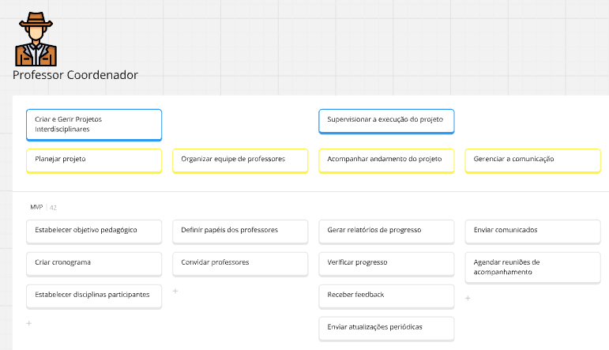
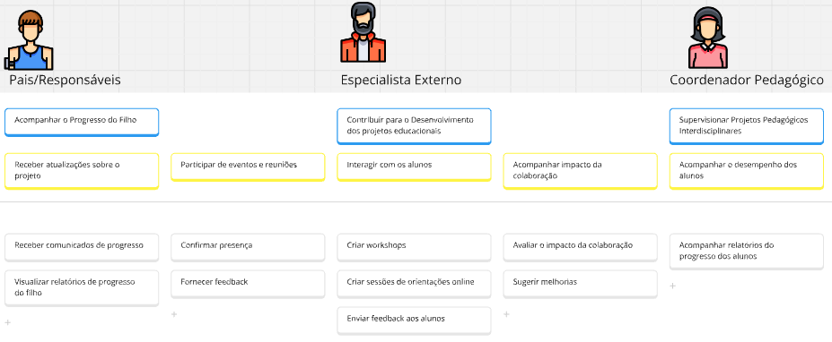
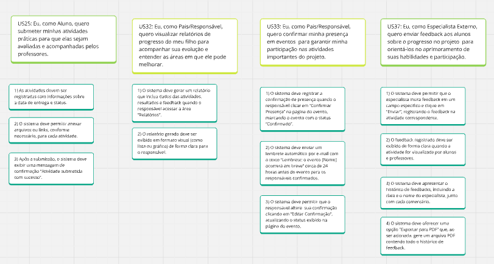

# USM - User Story Mapping

## Contexto 
A EduConnect é uma empresa criada para abordar desafios enfrentados por instituições educacionais na gestão de projetos interdisciplinares e atividades extracurriculares. Inspirada pela necessidade de integrar disciplinas e proporcionar experiências educacionais práticas, a empresa busca desenvolver uma plataforma digital que simplifique a criação, organização e avaliação desses projetos.

Com foco em acessibilidade, engajamento e colaboração, a EduConnect enfrenta problemas comuns como a fragmentação de ferramentas, limitações de recursos, dificuldades de comunicação entre stakeholders e a baixa interatividade de sistemas tradicionais. O objetivo principal da empresa é transformar a gestão educacional, promovendo maior eficiência e aprendizado significativo.

## Personas

### Professor Coordenador
Supervisiona projetos interdisciplinares, organizando equipes e assegurando o alinhamento pedagógico. Deseja ferramentas para facilitar a comunicação, o acompanhamento das atividades e a gestão das entregas dos grupos.

### Professor Participante
Colabora em projetos interdisciplinares, contribuindo com sua expertise para atividades específicas. Deseja clareza nas tarefas atribuídas, integração com outros participantes e facilidade no registro de contribuições.

### Aluno
Participa de projetos interdisciplinares, desenvolvendo atividades colaborativas e práticas. Deseja uma plataforma intuitiva para acessar informações, realizar entregas e interagir com colegas e professores.

### Pais/Responsáveis
Acompanham o progresso educacional dos alunos, fornecendo suporte e incentivando sua participação. Desejam uma visão clara do desempenho e ferramentas para comunicação direta com os educadores.

### Especialista Externo
Contribui com conhecimentos específicos para enriquecer os projetos interdisciplinares. Deseja acesso fácil às informações relevantes e uma forma prática de interagir com os participantes.

### Coordenador Pedagógico
Supervisiona projetos interdisciplinares, garantindo que estejam alinhados aos objetivos pedagógicos da instituição. Ele deseja ferramentas para acompanhar múltiplos projetos, avaliar impactos educacionais e garantir o alinhamento com as diretrizes curriculares.

## MIRO

## Quadro do Miro

<iframe src="https://miro.com/app/board/uXjVL7x-bvg=/" width="100%" height="600" frameborder="0"></iframe>

*Link do Miro:* [MIRO](URL "https://miro.com/app/board/uXjVL7x-bvg=/")

## USM - Professor Coordenador

## USM - Professor Participante

## USM - Aluno

## USM - Pais, Especialista Externo e Coordenador Pedagógico

# Histórias de Usuários

## Histórias do Usuário - Professor Coordenador

| **ID** | **Descrição**                                                                                                                                                 |
|--------|----------------------------------------------------------------------------------------------------------------------------------------------------------------|
| US1    | Eu, como professor coordenador, quero estabelecer o objetivo pedagógico do projeto  para garantir que o projeto tenha uma direção clara com os objetivos educacionais. |
| US2    | Eu, como Professor Coordenador, quero criar um cronograma de atividades para organizar o tempo e as atividades do projeto.                                    |
| US3    | Eu, como Professor Coordenador, quero estabelecer disciplinas participantes para integrar as diferentes áreas do conhecimento.                               |
| US4    |  Eu, como Professor Coordenador, quero definir os papéis de cada professor para garantir que todos tenham clareza sobre suas funções. |
| US5    | Eu, como Professor Coordenador, quero enviar convites para os professores para formalizar a participação e integrar os membros da equipe    |
| US6    | Eu, como Professor Coordenador, quero gerar relatórios sobre o progresso dos alunos para monitorar o andamento do projeto.                       |
| US7    | Eu, como Professor Coordenador, quero verificar o progresso das atividades para garantir que o projeto esteja progredindo conforme o planejado.  |
| US8    | Eu, como Professor Coordenador, quero receber feedback dos alunos e professores   para ajustar a execução do projeto conforme as necessidades. |
| US9    | Eu, como Professor Coordenador, quero enviar atualizações periódicas para manter todos envolvidos informados sobre o andamento do projeto. |
| US10   | Eu, como Professor Coordenador, quero enviar comunicados para pais e especialistas para mantê-los atualizados e engajados no processo.            |
| US12   | Eu, como Professor Coordenador, quero agendar reuniões de acompanhamento com pais e especialistas para facilitar a comunicação e o engajamento destes no progresso do aluno. |

## Histórias do Usuário - Professor Participante

| **ID** | **Descrição**                                                                                                                                                 |
|--------|----------------------------------------------------------------------------------------------------------------------------------------------------------------|
| US13   | Eu, como Professor Participante, quero criar planos de aula para garantir que as aulas estejam alinhadas com os objetivos do projeto interdisciplinar. |
| US14   | Eu, como Professor Participante, quero compartilhar meu plano de aula com outros professores para garantir que todos estejam alinhados nas atividades do projeto. |
| US15   | Eu, como Professor Participante, quero registrar as os resultados das atividades realizadas  para manter um registro detalhado das ações e avanços do projeto.  |
| US16   | Eu, como Professor Participante, quero compartilhar dados de progresso das atividades com outros professores para garantir que todos se atualizem sobre o progresso e adaptem as atividades conforme necessário. |
| US17   | Eu, como Professor Participante, quero monitorar a evolução dos alunos para ajustar minhas atividades e intervenções conforme a necessidade do aluno. |
| US18   | Eu, como Professor Participante, quero inserir feedback sobre o desempenho dos alunos  para orientá-los no seu desenvolvimento e melhorar sua performance. |
| US19   | Eu, como Professor Participante, quero criar tarefas colaborativas para promover a colaboração entre os professores e enriquecer a experiência de ensino. |
| US20   | Eu, como Professor Participante, quero atribuir tarefas para professores e alunos para garantir que as responsabilidades sejam claras e as tarefas sejam realizadas conforme o planejamento. |
| US21   | Eu, como Professor Participante, quero visualizar as contribuições de outros professores  para garantir que todos estão alinhados e colaborando nas atividades do projeto. |
| US22   | Eu, como Professor Participante, quero compartilhar feedback sobre as atividades com professores e coordenadores  para melhorar as atividades e promover a reflexão contínua sobre o projeto. |

## Histórias do Usuário - Aluno e Pais

| **ID** | **Descrição**                                                                                                                                                 |
|--------|----------------------------------------------------------------------------------------------------------------------------------------------------------------|
| US23   | Eu, como Aluno, quero confirmar minha inscrição no projeto para garantir minha participação e receber todas as informações relacionadas ao projeto. |
| US24   | Eu, como Aluno, quero acessar os materiais iniciais do projeto  para me familiarizar com o conteúdo e as expectativas do projeto desde o início. |
| US25   | Eu, como Aluno, quero submeter minhas atividades práticas para que elas sejam avaliadas e acompanhadas pelos professores. |
| US26   | Eu, como Aluno, quero registrar meu progresso nas atividades para que os professores e colegas possam acompanhar meu desenvolvimento. |
| US27   | Eu, como Aluno, quero visualizar o feedback dos professores  para entender o que preciso melhorar nas minhas atividades e como posso evoluir no projeto. |
| US28   | Eu, como Aluno, quero atualizar minhas entregas com base no feedback recebido para aprimorar meu trabalho e atender às expectativas dos professores. |
| US29   | Eu, como Aluno, quero baixar documentos e materiais compartilhados para ter acesso aos recursos necessários para o desenvolvimento do projeto. |
| US30   | Eu, como Aluno, quero me inscrever em atividades extracurriculares para ampliar minha participação no projeto e me envolver mais com a comunidade escolar. |
| US31   | Eu, como Aluno, quero acompanhar o cronograma de atividades extracurriculares para organizar meu tempo e não perder nenhuma atividade importante. |
| US32   | Eu, como Pais/Responsável, quero receber comunicados de progresso para ficar informado sobre o desenvolvimento do meu filho no projeto. |
| US33   | Eu, como Pais/Responsável, quero visualizar relatórios de progresso do meu filho para acompanhar sua evolução e entender as áreas em que ele pode melhorar. |
| US34   | Eu, como Pais/Responsável, quero confirmar minha presença em eventos/apresentações finais para garantir minha participação nas atividades importantes do projeto. |
| US35   | Eu, como Pais/Responsável, quero fornecer feedback sobre eventos através para contribuir com minha opinião sobre a experiência  do projeto. |

## Histórias do Usuário - Especialista Externo e Coordenador Pedagógico

| **ID** | **Descrição**                                                                                                                                                 |
|--------|----------------------------------------------------------------------------------------------------------------------------------------------------------------|
| US36   | Eu, como Especialista Externo, quero criar workshops  para contribuir com meu conhecimento técnico e ajudar os alunos a entender melhor o conteúdo do projeto. |
| US37   | Eu, como Especialista Externo, quero criar sessões de orientação para contribuir com meu conhecimento técnico e ajudar os alunos a entender melhor o conteúdo do projeto. |
| US38   | Eu, como Especialista Externo, quero enviar feedback aos alunos sobre o progresso no projeto através da plataforma para orientá-los no aprimoramento de suas habilidades e participação. |
| US39   | Eu, como Especialista Externo, quero avaliar o impacto da colaboração com relatórios automatizados para entender minha contribuição e melhorar futuras colaborações. |
| US40   | Eu, como Especialista Externo, quero sugerir melhorias para os projetos através de comentários para contribuir com insights e ajudar a aprimorar o projeto em andamento. |
| US41   | Eu, como Coordenador Pedagógico, quero acompanhar relatórios do progresso dos alunos nas atividades para supervisionar seus desempenhos. |

# Criterios de Aceitação 

## Criterios de Aceitação 

### US1
*US1: Eu, como professor coordenador, quero estabelecer o objetivo pedagógico do projeto  para garantir que o projeto tenha uma direção clara com os objetivos educacionais.*

- 1) O sistema deve fornecer um botão “Editar” que permita modificar o objetivo.

- 2)  Ao clicar em “Atualizar” após a edição, o novo objetivo deve ser salvo e a mensagem “Objetivo atualizado” exibida..

- 3) Após o salvamento, o objetivo pedagógico deve ser exibido na área de informações do projeto para que todos os professores o visualizem.

### US2
*US2: Eu, como Professor Coordenador, quero criar um cronograma de atividades para organizar o tempo e as atividades do projeto.*

- 1) O sistema deve permitir que o professor crie um evento no cronograma ao preencher os campos “Data”, “Atividade” e “Entrega”..

- 2) O cronograma completo, contendo todos os eventos, deve estar visível para professores, alunos e responsáveis ao acessarem a página do projeto..

- 3) Quando um evento for modificado, o sistema deve enviar automaticamente uma notificação (via e-mail) com a mensagem “Cronograma atualizado” para todos os usuários cadastrados..

### US3
*US3: Eu, como Professor Coordenador, quero estabelecer disciplinas participantes para integrar as diferentes áreas do conhecimento.*

- 1) O sistema deve permitir que o professor selecione uma disciplina de uma lista e clique em “Adicionar” para vinculá-la ao projeto.

- 2) O sistema deve permitir que o professor remova uma disciplina clicando em “Remover” ao lado da disciplina já adicionada..

- 3) O cronograma do projeto deve exibir, em cada evento relacionado, o nome da disciplina e os professores associados..

- 4) Ao adicionar uma disciplina, o sistema deve enviar um e-mail aos professores responsáveis contendo o texto “Você foi adicionado ao projeto [Nome do Projeto] na disciplina [Nome da Disciplina]”.

### US5
*US5: Eu, como Professor Coordenador, quero enviar convites para os professores para formalizar a participação e integrar os membros da equipe*

- 1) O sistema deve permitir que o professor selecione um professor e clique em “Enviar Convite”.

- 2) Quando o professor destinatário responder ao convite, o sistema deve atualizar o status para “Aceito” ou “Rejeitado” e notificar o coordenador com essa atualização.

- 3) O sistema deve possibilitar que o coordenador reenvie o convite se este não for aceito, através de uma ação “Reenviar Convite”.

### US12
*US12: Eu, como Professor Coordenador, quero agendar reuniões de acompanhamento com pais e especialistas para facilitar a comunicação e o engajamento dos pais e especialistas no progresso do aluno.*

- 1) O sistema deve permitir que o professor agende uma reunião preenchendo os campos “Data”, “Hora” e “Participantes” e clicando em “Agendar”, registrando a reunião no calendário do projeto..

- 2) Ao agendar a reunião, o sistema deve enviar automaticamente convites por e-mail a todos os participantes com o assunto “Convite para reunião de acompanhamento”..

- 3) Se o professor editar os detalhes da reunião, o sistema deve atualizar a reunião quando o botão “Atualizar” for clicado e notificar os participantes sobre a alteração.

- 4) Se o professor cancelar a reunião, o sistema deve removê-la do calendário e enviar uma notificação de cancelamento aos participantes.

### US13
*US13: Eu, como Professor Participante, quero criar atividades e planos de aula para garantir que as aulas estejam alinhadas com os objetivos do projeto interdisciplinar.*

- 1) O sistema deve permitir que o professor crie uma atividade ao preencher os campos “Título”, “Descrição”, “Data de Entrega” e “Objetivos”..

- 2) O sistema deve permitir que o professor edite uma atividade antes da execução desta ao clicar em “Editar”..

### US16
*US16: Eu, como Professor Participante, quero compartilhar dados de progresso das atividades com outros professores para garantir que todos se atualizem sobre o progresso e adaptem as atividades conforme necessário.*

- 1) O sistema deve permitir que o professor selecione uma atividade e clique em “Compartilhar Dados” com status, pontuação ou feedback dos alunos.

- 2) O sistema deve possibilitar que o professor escolha, por meio de opções marcáveis, quais dados específicos deseja compartilhar e, ao confirmar, os dados sejam salvos para visualização..

- 3) Os dados compartilhados devem ser exibidos em formato visual (gráficos, tabelas ou listas) quando outros professores acessarem a área “Dados Compartilhados”.

- 4) O professor deve poder adicionar comentários ou notas explicativas aos dados compartilhados para contextos adicionais.

### US19
*US19: Eu, como Professor Participante, quero criar tarefas colaborativas para promover a colaboração entre os professores e enriquecer a experiência de ensino.*

- 1) O sistema deve permitir que o professor crie uma tarefa colaborativa preenchendo os campos “Descrição”, “Data de Entrega” e “Objetivos”.

- 2) A tarefa colaborativa criada deve ser exibida na seção “Tarefas Colaborativas” com todas as suas informações detalhadas.

- 3) O sistema deve permitir que o professor atribuam a tarefa a outros professores selecionando-os e clicando em “Atribuir”.

- 4) O professor deve poder adicionar comentários ou notas explicativas aos dados compartilhados para contextos adicionais.

### US21
*US21: Eu, como Professor Participante, quero visualizar as contribuições de outros professores  para garantir que todos estão alinhados e colaborando nas atividades do projeto.*

- 1) O sistema deve permitir que o professor acesse a área “Contribuições dos Professores” e, ao clicar em um item, exiba os detalhes da contribuição, incluindo o nome do professor, a descrição e a data.

- 2) A lista de contribuições deve apresentar o status de conclusão de cada item.

- 3) Ao clicar em uma contribuição específica, o sistema deve exibir os documentos ou recursos associados à contribuição.

### US23
*US23: Eu, como Aluno, quero confirmar minha inscrição no projeto para garantir minha participação e receber todas as informações relacionadas ao projeto.*

- 1) O sistema deve exibir a lista de projetos disponíveis para inscrição.

- 2) O aluno deve poder se inscrever em um projeto com um único clique em “Inscrever-se” e obter confirmação imediata.

- 3) O sistema deve enviar uma confirmação de inscrição via e-mail com o texto “Inscrição confirmada.

### US25
*US25: Eu, como Aluno, quero submeter minhas atividades práticas para que elas sejam avaliadas e acompanhadas pelos professores.*

- 1) As atividades devem ser registradas com informações sobre a data de entrega e status.

- 2) O sistema deve permitir anexar arquivos ou links, conforme necessário, para cada atividade.

- 3) Após a submissão, o sistema deve exibir uma mensagem de confirmação “Atividade submetida com sucesso”.

### US32
*US30: Eu, como Pais/Responsável, quero visualizar relatórios de progresso do meu filho para acompanhar sua evolução e entender as áreas em que ele pode melhorar.*

- 1) O sistema deve gerar um relatório que inclua dados das atividades, resultados e feedback quando o responsável acessar a área “Relatórios”.

- 2) O relatório gerado deve ser exibido em formato visual (como lista ou gráfico) de forma clara para o responsável.

### US33
*US31: Eu, como Pais/Responsável, quero confirmar minha presença em eventos  para garantir minha participação nas atividades importantes do projeto.*

- 1) O sistema deve registrar a confirmação de presença quando o responsável clicar em “Confirmar Presença” na página do evento, marcando o evento com o status “Confirmado”.

- 2) O sistema deve enviar um lembrete automático por e-mail com o texto “Lembrete: o evento [Nome] ocorrerá em breve” cerca de 24 horas antes do evento para os responsáveis confirmados.

- 3) O sistema deve permitir que o responsável altere  sua confirmação clicando em “Editar Confirmação”, atualizando o status exibido na página do evento.

### US37
*US35: Eu, como Especialista Externo, quero enviar feedback aos alunos sobre o progresso no projeto  para orientá-los no aprimoramento de suas habilidades e participação.*

- 1) O sistema deve permitir que o especialista insira feedback em um campo específico e clique em “Enviar”, registrando o feedback na atividade correspondente.

- 2) O feedback registrado deve ser exibido de forma clara quando a atividade for visualizada por alunos e professores.

- 3) O sistema deve apresentar o histórico de feedbacks, incluindo a data e o nome do especialista, junto com cada comentário.

- 4) O sistema deve oferecer uma opção “Exportar para PDF” que, ao ser acionada, gere um arquivo PDF contendo todo o histórico de feedback.O relatório deve ser exportável para PDF.

