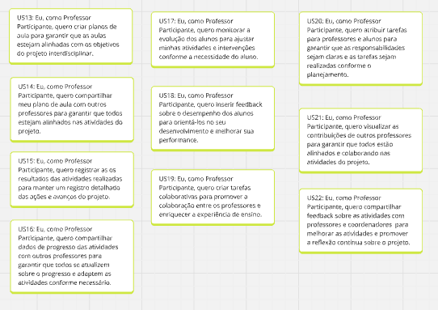
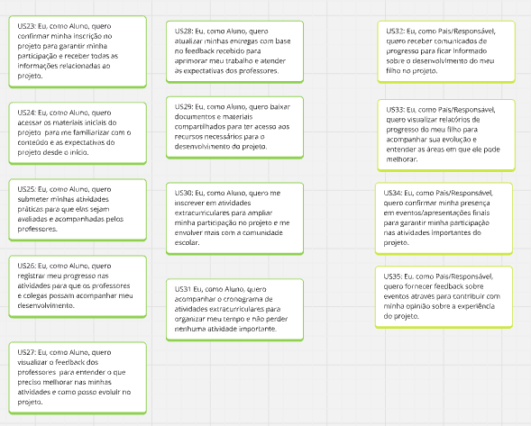
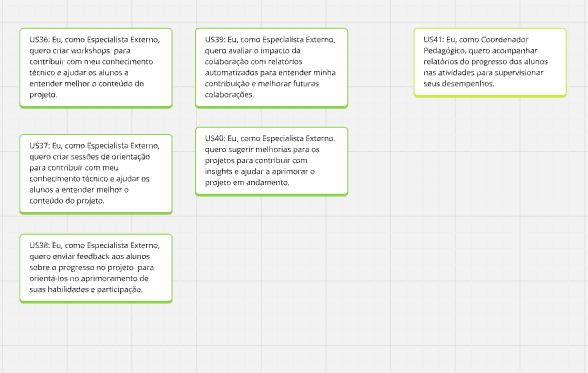

# USM - User Story Mapping

## MIRO

## Quadro do Miro

<iframe src="https://miro.com/app/board/uXjVL7x-bvg=/" width="100%" height="600" frameborder="0"></iframe>

*Link do Miro:* [MIRO](URL "https://miro.com/app/board/uXjVL7x-bvg=/")

## USM - Professor Coordenador

## USM - Professor Participante

## USM - Aluno

## USM - Pais, Especialista Externo e Coordenador Pedagócio

# Histórias de Usuários

## Histórias do Usuário - Professor Coordenador

| **ID** | **Descrição**                                                                                                                                                 |
|--------|----------------------------------------------------------------------------------------------------------------------------------------------------------------|
| US1    | Eu, como professor coordenador, quero estabelecer o objetivo pedagógico do projeto no sistema para garantir que o projeto tenha uma direção clara e alinhada com os objetivos educacionais. |
| US2    | Eu, como Professor Coordenador, quero criar um cronograma de atividades para organizar o tempo e as atividades do projeto.                                    |
| US3    | Eu, como Professor Coordenador, quero estabelecer disciplinas participantes para integrar as diferentes áreas do conhecimento.                                |
| US4    | Eu, como Professor Coordenador, quero definir os papéis e responsabilidades de cada professor no sistema, para garantir que todos tenham clareza sobre suas funções. |
| US5    | Eu, como Professor Coordenador, quero enviar convites para os professores através do sistema, para formalizar a participação e integrar os membros da equipe.    |
| US6    | Eu, como Professor Coordenador, quero gerar relatórios automáticos sobre o progresso dos alunos para monitorar o andamento do projeto.                        |
| US7    | Eu, como Professor Coordenador, quero verificar o progresso das atividades na plataforma, para garantir que o projeto esteja progredindo conforme o planejado.  |
| US8    | Eu, como Professor Coordenador, quero receber feedback dos alunos e professores diretamente para ajustar a execução do projeto conforme as necessidades e percepções dos participantes. |
| US9    | Eu, como Professor Coordenador, quero enviar atualizações periódicas aos envolvidos via sistema, para manter todos envolvidos informados sobre o andamento do projeto. |
| US10   | Eu, como Professor Coordenador, quero enviar comunicados para pais e especialistas via sistema, para mantê-los atualizados e engajados no processo.            |
| US12   | Eu, como Professor Coordenador, quero agendar reuniões de acompanhamento com pais e especialistas pelo sistema, para facilitar a comunicação e o engajamento dos pais e especialistas no progresso do aluno. |

## Histórias do Usuário - Professor Participante

| **ID** | **Descrição**                                                                                                                                                 |
|--------|----------------------------------------------------------------------------------------------------------------------------------------------------------------|
| US13   | Eu, como Professor Participante, quero criar atividades e planos de aula para garantir que as aulas estejam alinhadas com os objetivos do projeto interdisciplinar. |
| US14   | Eu, como Professor Participante, quero compartilhar meu plano de aula com outros professores via plataforma para garantir que todos estejam alinhados nas atividades do projeto. |
| US15   | Eu, como Professor Participante, quero registrar as atividades realizadas e seus resultados para manter um registro detalhado das ações e avanços do projeto.  |
| US16   | Eu, como Professor Participante, quero compartilhar dados de progresso das atividades com outros professores na plataforma para garantir que todos se atualizem sobre o progresso e adaptem as atividades conforme necessário. |
| US17   | Eu, como Professor Participante, quero monitorar a evolução dos alunos através do sistema, para ajustar minhas atividades e intervenções conforme a necessidade do aluno. |
| US18   | Eu, como Professor Participante, quero inserir feedback sobre o desempenho dos alunos diretamente para orientá-los no seu desenvolvimento e melhorar sua performance. |
| US19   | Eu, como Professor Participante, quero criar tarefas colaborativas para promover a colaboração entre os professores e enriquecer a experiência de ensino. |
| US20   | Eu, como Professor Participante, quero atribuir tarefas para professores e alunos através para garantir que as responsabilidades sejam claras e as tarefas sejam realizadas conforme o planejamento. |
| US21   | Eu, como Professor Participante, quero visualizar as contribuições de outros professores para garantir que todos estão alinhados e colaborando nas atividades do projeto. |
| US22   | Eu, como Professor Participante, quero compartilhar feedback sobre as atividades com professores e coordenadores para melhorar as atividades e promover a reflexão contínua sobre o projeto. |

## Histórias do Usuário - Aluno e Pais

| **ID** | **Descrição**                                                                                                                                                 |
|--------|----------------------------------------------------------------------------------------------------------------------------------------------------------------|
| US23   | Eu, como Aluno, quero confirmar minha inscrição no projeto para garantir minha participação e receber todas as informações relacionadas ao projeto. |
| US24   | Eu, como Aluno, quero acessar os materiais iniciais do projeto para me familiarizar com o conteúdo e as expectativas do projeto desde o início. |
| US25   | Eu, como Aluno, quero submeter minhas atividades práticas e colaborativas para que elas sejam avaliadas e acompanhadas pelos professores. |
| US26   | Eu, como Aluno, quero registrar meu progresso nas atividades diretamente na plataforma para que os professores e colegas possam acompanhar meu desenvolvimento. |
| US27   | Eu, como Aluno, quero visualizar o feedback dos professores para entender o que preciso melhorar nas minhas atividades e como posso evoluir no projeto. |
| US28   | Eu, como Aluno, quero atualizar minhas entregas com base no feedback recebido para aprimorar meu trabalho e atender às expectativas dos professores. |
| US29   | Eu, como Aluno, quero baixar documentos e materiais compartilhados para ter acesso aos recursos necessários para o desenvolvimento do projeto. |
| US30   | Eu, como Aluno, quero me inscrever em atividades extracurriculares diretamente para ampliar minha participação no projeto e me envolver mais com a comunidade escolar. |
| US31   | Eu, como Aluno, quero acompanhar o cronograma de atividades extracurriculares, para organizar meu tempo e não perder nenhuma atividade importante. |
| US32   | Eu, como Pais/Responsável, quero receber comunicados de progresso automaticamente pela plataforma para ficar informado sobre o desenvolvimento do meu filho no projeto. |
| US33   | Eu, como Pais/Responsável, quero visualizar relatórios de progresso do meu filho para acompanhar sua evolução e entender as áreas em que ele pode melhorar. |
| US34   | Eu, como Pais/Responsável, quero confirmar minha presença em eventos/apresentações finais via plataforma para garantir minha participação nas atividades importantes do projeto. |
| US35   | Eu, como Pais/Responsável, quero fornecer feedback sobre eventos através da plataforma para contribuir com minha opinião sobre a experiência do projeto. |

## Histórias do Usuário - Especialista Externo e Coordenador Pedagógico

| **ID** | **Descrição**                                                                                                                                                 |
|--------|----------------------------------------------------------------------------------------------------------------------------------------------------------------|
| US36   | Eu, como Especialista Externo, quero criar e ministrar workshops online via sistema para contribuir com meu conhecimento técnico e ajudar os alunos a entender melhor o conteúdo do projeto. |
| US37   | Eu, como Especialista Externo, quero criar sessões de orientação online para contribuir com meu conhecimento técnico e ajudar os alunos a entender melhor o conteúdo do projeto. |
| US38   | Eu, como Especialista Externo, quero enviar feedback aos alunos sobre o progresso no projeto através da plataforma para orientá-los no aprimoramento de suas habilidades e participação. |
| US39   | Eu, como Especialista Externo, quero avaliar o impacto da colaboração com relatórios automatizados para entender minha contribuição e melhorar futuras colaborações. |
| US40   | Eu, como Especialista Externo, quero sugerir melhorias para os projetos através de comentários para contribuir com insights e ajudar a aprimorar o projeto em andamento. |
| US41   | Eu, como Coordenador Pedagógico, quero acompanhar relatórios do progresso dos alunos nas atividades para supervisionar seus desempenhos. |

# Criterios de Aceitação 

## Criterios de Aceitação 

### US1
*US1: Eu, como professor coordenador, quero estabelecer o objetivo pedagógico do projeto no sistema para garantir que o projeto tenha uma direção clara e alinhada com os objetivos educacionais.*
- 1) O sistema deve permitir editar ou atualizar o objetivo pedagógico após a criação.
- 2)  A definição do objetivo pedagógico deve ser salva automaticamente.
- 3) O objetivo pedagógico inserido deve ser visível para todos os professores envolvidos no projeto.
### US2
*US2: Eu, como Professor Coordenador, quero criar um cronograma de atividades para organizar o tempo e as atividades do projeto.*
- 1) O sistema deve permitir a criação de um cronograma com datas de atividades, eventos e entregas.
- 2) O cronograma deve permitir ajustes facilmente sem perder informações anteriores.
- 3) O cronograma deve ser visualizável por todos os professores, alunos e pais envolvidos.
- 4) O sistema deve enviar notificações automáticas para mudanças no cronograma.
### US3
*US3: Eu, como Professor Coordenador, quero estabelecer disciplinas participantes para integrar as diferentes áreas do conhecimento.*
- 1) O sistema deve permitir a seleção e adição de disciplinas associadas ao projeto.
- 2) O professor coordenador deve poder remover ou alterar as disciplinas durante o processo de planejamento.
- 3) A plataforma deve exibir as disciplinas e os professores associados a elas no cronograma.
- 4) Os professores de disciplinas associadas devem ser notificados sobre sua inclusão no projeto.
### US5
*US5: Eu, como Professor Coordenador, quero enviar convites para os professores através do sistema, para formalizar a participação e integrar os membros da equipe.*
- 1) O sistema deve permitir que o professor coordenador envie convites para os professores por e-mail ou notificação dentro da plataforma.
- 2) O sistema deve notificar o coordenador quando o convite for aceito ou rejeitado.
- 3) O professor deve poder reenviar convites caso não tenha sido aceito.
### US12
*US12: Eu, como Professor Coordenador, quero agendar reuniões de acompanhamento com pais e especialistas pelo sistema, para facilitar a comunicação e o engajamento dos pais e especialistas no progresso do aluno.*
- 1) O sistema deve permitir que o professor agende reuniões diretamente na plataforma.
- 2) O sistema deve enviar convites e lembretes automáticos sobre a reunião para todos os envolvidos.
- 3) O sistema deve permitir a modificação ou cancelamento do agendamento.

### US13
*US13: Eu, como Professor Participante, quero criar atividades e planos de aula para garantir que as aulas estejam alinhadas com os objetivos do projeto interdisciplinar.*
- 1) O sistema deve permitir a criação de atividades detalhadas com datas de entrega e objetivos.
- 2) O professor deve poder editar o plano de aula até o momento de sua execução.
### US16
*US16: Eu, como Professor Participante, quero compartilhar dados de progresso das atividades com outros professores na plataforma para garantir que todos se atualizem sobre o progresso e adaptem as atividades conforme necessário.*
- 1) O sistema deve permitir que o professor compartilhe os dados de progresso das atividades, incluindo status, pontuação ou feedback dos alunos.
- 2) O professor deve poder selecionar quais dados específicos deseja compartilhar com os outros professores.
- 3) O progresso das atividades deve ser apresentado de forma visual (gráficos, tabelas ou listas) para facilitar a compreensão.
- 4) O professor deve poder adicionar comentários ou notas explicativas aos dados compartilhados para contextos adicionais.

### US19
*US19: Eu, como Professor Participante, quero criar tarefas colaborativas para promover a colaboração entre os professores e enriquecer a experiência de ensino.*
- 1) O sistema deve permitir que o professor compartilhe os dados de progresso das atividades, incluindo status, pontuação ou feedback dos alunos.
- 2) O professor deve poder selecionar quais dados específicos deseja compartilhar com os outros professores.
- 3) O progresso das atividades deve ser apresentado de forma visual (gráficos, tabelas ou listas) para facilitar a compreensão.
- 4) O professor deve poder adicionar comentários ou notas explicativas aos dados compartilhados para contextos adicionais.
### US21
*US21: Eu, como Professor Participante, quero visualizar as contribuições de outros professores  para garantir que todos estão alinhados e colaborando nas atividades do projeto.*
- 1) O sistema deve permitir que o professor crie tarefas colaborativas, incluindo a descrição da tarefa, prazos e objetivos.
- 2) O professor deve poder visualizar o progresso de cada membro da equipe dentro da tarefa.
- 3) O sistema deve permitir que os professores compartilhem documentos e recursos dentro da tarefa colaborativa.
### US23
*US23: Eu, como Aluno, quero confirmar minha inscrição no projeto para garantir minha participação e receber todas as informações relacionadas ao projeto.*
- 1) O sistema deve exibir a lista de projetos disponíveis para inscrição.
- 2) O aluno deve ser capaz de se inscrever em um projeto com um clique e obter confirmação imediata
- 3) O sistema deve enviar uma confirmação de inscrição via e-mail ou notificação no aplicativo.

### US24
*US24: Eu, como Aluno, quero acessar os materiais iniciais do projeto  para me familiarizar com o conteúdo e as expectativas do projeto desde o início.*
- 1) O sistema deve exibir a lista de projetos disponíveis para inscrição.
- 2) O aluno deve ser capaz de se inscrever em um projeto com um clique e obter confirmação imediata.
- 3) O sistema deve enviar uma confirmação de inscrição via e-mail ou notificação no aplicativo.
### US25
*US25: Eu, como Aluno, quero submeter minhas atividades práticas e colaborativas para que elas sejam avaliadas e acompanhadas pelos professores.*
- 1) As atividades devem ser registradas com informações sobre a data de entrega e status.
- 2) O sistema deve permitir anexar arquivos ou links, conforme necessário, para cada atividade.
- 3) O aluno deve receber uma confirmação de que a atividade foi submetida corretamente.
### US30
*US30: Eu, como Pais/Responsável, quero visualizar relatórios de progresso do meu filho para acompanhar sua evolução e entender as áreas em que ele pode melhorar.*
- 1) O sistema deve gerar relatórios periódicos sobre o desempenho do aluno no projeto.
- 2) O relatório deve incluir informações sobre atividades, resultados e feedback.
### US31
*US31: Eu, como Pais/Responsável, quero confirmar minha presença em eventos/apresentações finais via  para garantir minha participação nas atividades importantes do projeto.*
- 1) A confirmação deve ser visível para os organizadores do evento.
- 2) O sistema deve enviar um lembrete automático sobre o evento para os pais confirmados.
- 3) Os pais devem poder cancelar ou modificar a confirmação até a data do evento.
### US35
*US35: Eu, como Especialista Externo, quero enviar feedback aos alunos sobre o progresso no projeto através da plataforma para orientá-los no aprimoramento de suas habilidades e participação.*
- 1) O sistema deve permitir ao especialista inserir feedback diretamente nas atividades dos alunos.
- 2) O feedback inserido deve ser visível para os alunos e professores.
- 3) O sistema deve garantir que o feedback seja registrado de forma clara e fácil de acessar.
- 4) O relatório deve ser exportável para PDF.

