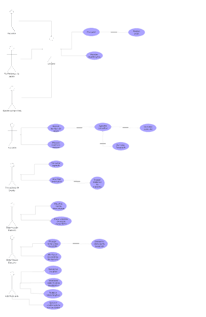
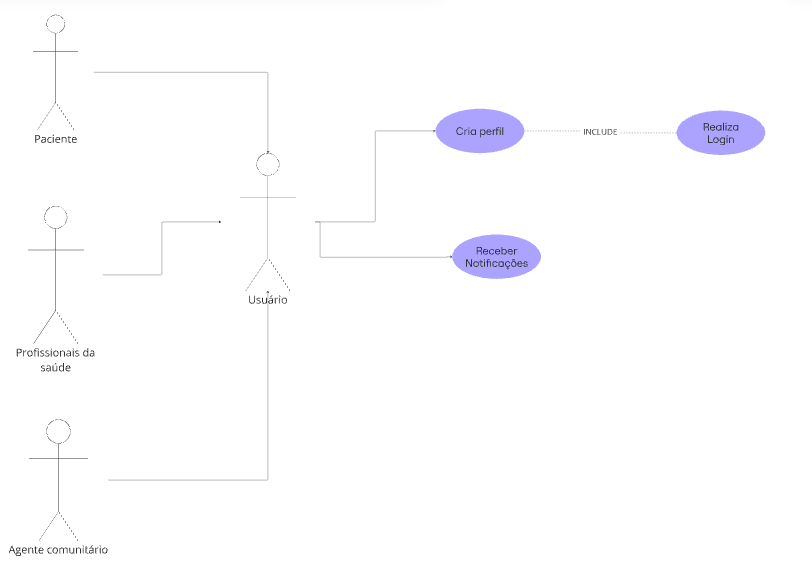
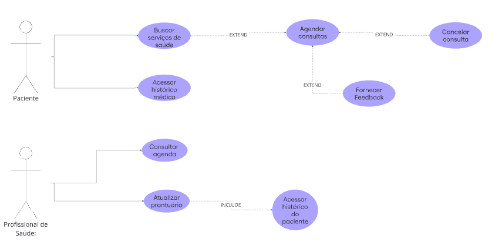
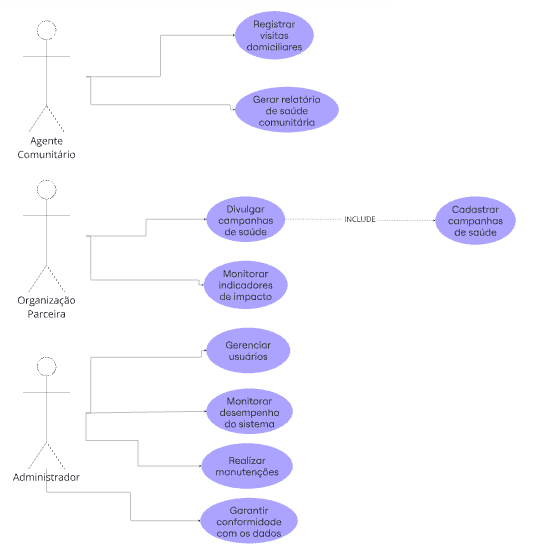

## Casos de Uso

## Quadro do Miro

<iframe src="https://miro.com/app/board/uXjVLhe14Zw=/" width="100%" height="600" frameborder="0"></iframe>

*Link do Miro:* [MIRO](URL "https://miro.com/app/board/uXjVLhe14Zw=/")

### Caso de Uso - Primeira Parte (Usuário)

### Caso de Uso - Segunda Parte (Paciente e Profissional de saúde)

### Caso de Uso - Terceira Parte (Agente comunitário, Organizações e Administrador)

## Especificações de Casos de Uso

Resolvemos fazer o uso de dois casos específicos da ConnectCare, que foram representados no nosso diagrama: __Criar Perfil__ e __Agendar Consulta__.

## 1. Criar Perfil (Ator: paciente)

#### Fluxo básico:

1.1. O usuário não registrado clica no botão "criar perfil"

1.2. O sistema responde com uma página de formulário de criação de perfil

1.3. O usuário preenche os dados cadastrais (nome completo, CPF, data de nascimento, CNS)

1.4. O sistema valida as informações conforme RN01 (caso ocorra violação da regra, o fluxo FE01 é executado)

1.5. O usuário clica em "Finalizar Cadastro"

1.6. O perfil do usuário é criado e o caso de uso é encerrado.

#### Fluxo de Exceção 1:

Se o sistema não tiver preenchido os dados de acordo com RN01, lançar exceção "Revise os dados e tente novamente." e retorna ao passo 1.3.

#### Regra de Negócio 1:

Nome completo (255 caracteres MAX)

CPF (###.###.###-XX)

Data de nascimento (##/##/####)

Carteira Nacional de Saúde (### #### #### ####)

## 2. Agendar Consultas (Ator: paciente)

#### Pré-condições:
i. O usuário deve estar logado;

ii. O usuário deve ser do tipo PACIENTE;

iii. O usuário deve estar realizando sua primeira consulta;

iv. O usuário deve ter buscado por serviços de saúde pela plataforma.

#### Fluxo básico:

2.1. O usuário de tipo paciente clica no botão "agendar consulta"

2.2. O sistema responde com uma página de envio de histórico e pede para o usuário anexar o arquivo de histórico

2.3. O paciente anexa e envia seu histórico médico à parte

2.4. O sistema valida o formato do arquivo conforme RN02 (caso ocorra violação da regra, FE02 é executado) e salva o histórico para consultas posteriores e em seguida exibe uma nova página de formulário

2.5. O paciente insere, nesse formulário, informações mais detalhadas a respeito da consulta que deseja agendar e clica no botão "submeter formulário"

2.6. O sistema recebe o formulário, corretamente agenda a consulta para o paciente e o caso de uso é encerrado.

#### Fluxo de Exceção 2:

Caso o arquivo de histórico médico não tenha sido corretamente fornecido conforme RN02, lançar exceção "Dado com formato inválido, revise o envio e tente novamente" e retorne ao passo 2.3.

#### Regra de Negócio 2:

Arquivo enviado deve ser de formato .PDF, .ODT, .DOCX, ou WORD.