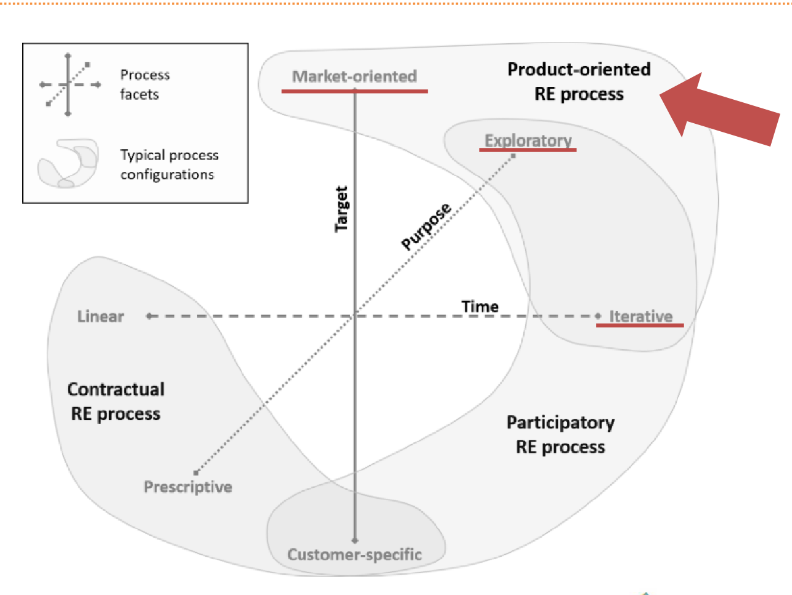

# Engenharia de requisitos

## Processo de ER

- **Tempo:** Iterativo
- **Propósito:** Exploratório
- **Alvo:** Orientado ao produto
- **Processo:** Orientado ao produto

## Atividades e técnicas de ER

### Elicitação e descoberta

- **Entrevista:** A entrevista conduzida com o cliente possui como objetivo identificar os problemas, desejos e necessidades do projeto, extraindo in- formações que nos permita construir os requisitos para o CD-MOJ.
- **Brainstorming:** Essa técnica será utilizada para que o grupo levante o máximo possível de ideias sobre os requisitos do projeto.
- **Grupo focal:** Reunindo o grupo, teremos a possibilidade de discutir sobre os pontos extraídos da entrevista e das ideias produzidas pelo Brainstor- ming, descobrindo mais requisitos que são adequados ao projeto.
- **Análise de personas:** Através de pesquisas realizadas sobre a plataforma foi identificado as personas do nosso projeto.

### Análise e consenso

- **Entrevista:** A entrevista será utilizada com propósito de junto com o cliente estabelecer um entendimento comum que os requisitos propostos estão alinhados com as espectativas do cliente.
- **Grupo focal:** O grupo focal terá como objetivo reunir os integrantes para discutir e analisar os requisitos em seu estado bruto, visando conciliá-lo e identificar se aqueles requisitos são suficientes e adequados.

### Declaração de requisitos

- **Documento de visão de produto:** Documento que servirá como norte durante todo o projeto, responsável por centralizar as informações rele- vantes a respeito dos requisitos.
- **Temas, Épicos e Histórias de Usuário:** A declaração do Backlog será realizada por meio da utilização de histórias de usuários. Desta maneira, pegaremos os requisitos estabelecidos e identificaremos se eles se encaixam em grandes histórias, como Épicos ou Temas, ou histórias de usuários que derivam destes. 

### Representação de requisitos

- **Prototipagem:** A propotipação será utilizada em seu estado de mais baixa fidalidade apenas para representar algumas interfaces que imple- mentaremos com os novos requisitos e auxiliar o cliente à entender onde esses requisitos se encaixam.

### Verificação e validação de requisitos

- **Definition of Done (DoD):** A partir da obtenção dos requisitos, utiliza- remos o DoD para identificar se todas condições ou critérios de aceitação dos requisitos estão sendo atendidos (DONE).

- **Definition of Ready (DoR):** Por meio de um conjunto critérios defini- dos, utilizaremos o DOR para idenfiticar se os requisitos obtidos possuem qualidade e estão prontos (READY).
- **Feedback:** Utilizaremos o Feedback do cliente para validar se os requisitos estão adequados ao projeto.

### Organização e atualização de requisitos

- **Product Backlog Building (PBB):** Será feito a listagem dos requisitos a serem atingidos, registro do progresso ao decorrer do projeto, assim como quais serão as prioridades.
- **MoSCoW:** O MoSCoW será utilizado para identificar as prioridades e
  pontos críticos do projeto.

## Engenharia de requisitos e o RAD/Open UP

| Fase do processo | Atividades ER                           | Prática                                                                           | Técnica                                | Resultado Esperado                                                 |
| ---------------- | --------------------------------------- | --------------------------------------------------------------------------------- | -------------------------------------- | ------------------------------------------------------------------ |
| **Concepção**    |                                         |                                                                                   |                                        |                                                                    |
|                  | Elicitação e Descoberta                 | Elicitar e descobrir as necessidades e requisitos do produto.                     | Entrevista, Grupo Focal, Brainstorming | Proposta de Solução e Requisitos Brutos                            |
|                  | Análise e Consenso                      | Analisar os requisitos brutos, alinhá-los de acordo com o projeto e conciliá-los. | Entrevista e Grupo Focal               | Lista de Requisitos RFs e RNFs                                     |
|                  | Representação                           | Representar de forma visual como os novos requisitos estarão em interface.        | Prototipação                           | Prototipação em papel                                              |
|                  | Verificação e Validação                 | Validar se os requisitos estão de acordo com o projeto.                           | Feedback                               | Lista de Requisitos adequados                                      |
| **Elaboração**   |                                         |                                                                                   |                                        |                                                                    |
|                  | Declaração                              | Representar o requisito                                                           | Temas, Épicos e Histórias de Usuário                                | Definição das US                                         |
|                  | Verificação e validação                 | Foco em validar se os requisitos em si estão bem definidos                        | DoD/DoR                                | Requisitos bem definidos, checklist                                |
|                  | Organização e atualização de requisitos | Manter registro dos requisitos                                                    | MoSCoW                                 | Lista de prioridades                                               |
| **Construção**   |                                         |                                                                                   |                                        |                                                                    |
|                  | Verificação e validação                 | Validar se os requisitos estão de acordo com o projeto                            | Feedback                               | Feedback do cliente                                                |
|                  | Verificação e validação                 | Foco em verificação do que foi construído                                         | DoD/DoR                                | Guiar tanto o cliente como o grupo durante a verificação/validação |
| **Transição**    | -                                       | -                                                                                 | -                                      | -                                                                  |
